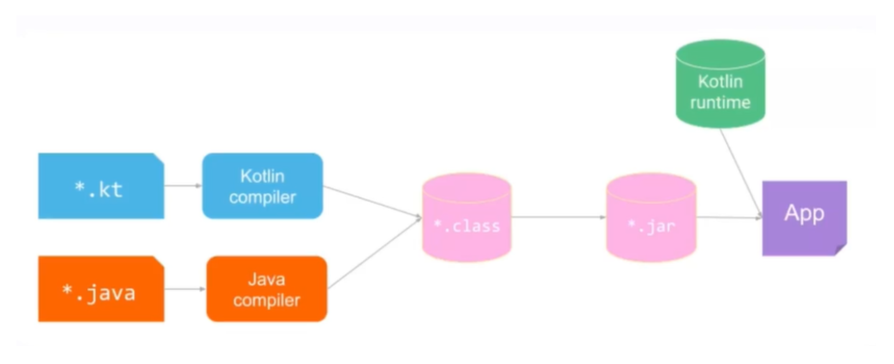
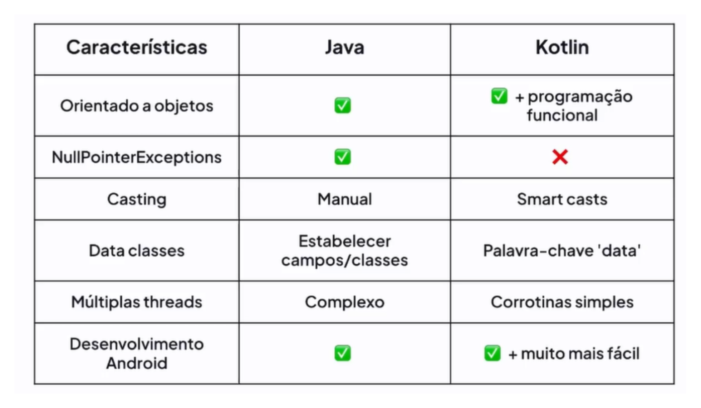

# OS PRIMEIROS PASSOS COM KOTLIN

## Diferenciação entre Java e Kotlin

Conehcido por sua interoperanilidade com Java (ao serem compiladas, ambas geram o mesmo código de máquina ao ser rodados na JVM - Java Virtual Machine), concisão, segurança em termos de nulidade (null safety) e por ser uma linguagem de código aberto.

### Processo de compilação Java e Kotlin

### Tabela Comparativa das linguagens
